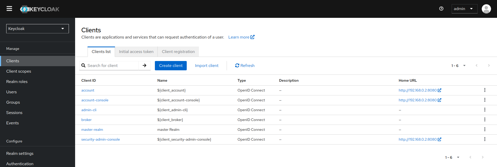
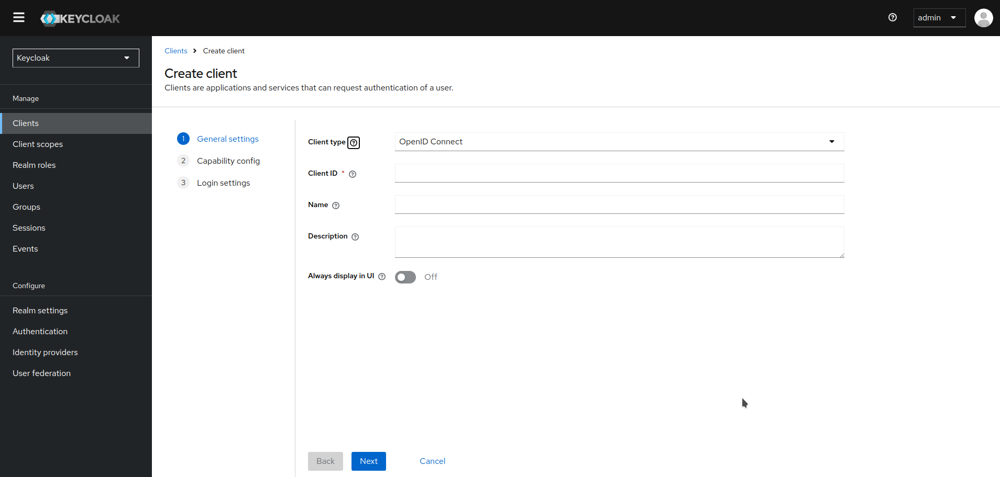
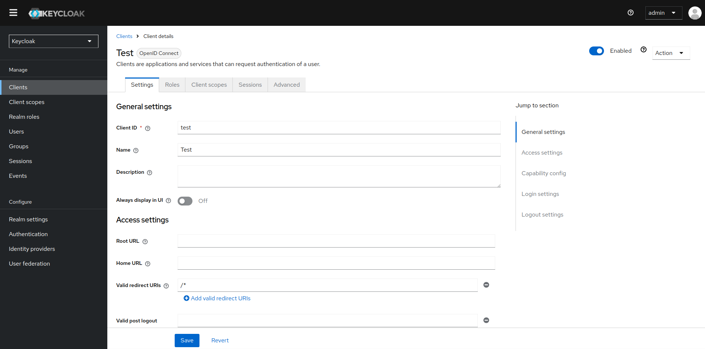

# Clientes OpenID Connect

## Creación de un cliente OpenID Connect

Para proteger una aplicación que utiliza el protocolo **OpenID Connect**, debes crear un cliente.

1. Haz clic en **Clients** en el menú.

2. Haz clic en **Create client**.

    

3. Deja el **Client type** como **OpenID Connect**.

4. Ingresa un **Client ID**.

    !!! tip

        Este ID es una cadena alfanumérica que se utiliza en las solicitudes OIDC y en la base de datos de Keycloak para identificar al cliente.

5. Proporciona un **Nombre** para el cliente.

    !!! tip

        Si planeas localizar este nombre, configura un valor de cadena de reemplazo. Por ejemplo, un valor de cadena como ${myapp}.

6. Haz clic en **Next** en las ventanas siguientes, manteniendo los datos predeterminados, hasta que puedas guardar la información del nuevo cliente.

Esta acción crea el cliente y te lleva a la pestaña Configuración, donde puedes realizar la configuración básica.

### Configuración básica

La pestaña de Configuración incluye muchas opciones para configurar este cliente.

### Configuración general

- **Client ID**: La cadena alfanumérica que se utiliza en las solicitudes OIDC y en la base de datos de Keycloak para identificar al cliente.

- **Name**: El nombre para el cliente en la pantalla de la UI de Keycloak. Para localizar el nombre, configura un valor de cadena de reemplazo. Por ejemplo, un valor de cadena como ${myapp}.

- **Description**: La descripción del cliente. Esta configuración también se puede localizar.

- **Always Display in Console**: Siempre listar este cliente en la Consola de Cuenta, incluso si este usuario no tiene una sesión activa.

### Configuración de acceso

- **Root URL**: Si Keycloak utiliza URLs relativas configuradas, este valor se antepone a ellas.

- **Home URL**: Proporciona la URL predeterminada para cuando el servidor de autenticación necesita redirigir o enlazar de nuevo al cliente.

- **Valid Redirect URIs**: Campo obligatorio. Ingresa un patrón de URL y haz clic en + para agregar y en - para eliminar URLs existentes, luego haz clic en Save. Se utiliza una coincidencia exacta (sensible a mayúsculas) para comparar las URIs de redirección válidas.
  Puedes usar comodines al final del patrón de URL, por ejemplo, [http://host.com/path/*](http://host.com/path/*). Para evitar problemas de seguridad, si la URI de redirección pasada contiene la parte de información del usuario o su ruta gestiona el acceso al directorio padre (/../), no se realiza una comparación con comodín, sino una coincidencia exacta estándar y segura.
  El comodín completo * también se puede configurar como una URI de redirección válida para permitir cualquier URI de redirección http o https. No lo uses en entornos de producción.
  Los patrones de URI de redirección exclusivos suelen ser más seguros. Consulta URIs de Redirección No Específicas para más información.

- **Web Origins**: Ingresa un patrón de URL y haz clic en + para agregar y en - para eliminar URLs existentes. Haz clic en Guardar.
  Esta opción maneja el Intercambio de Recursos de Origen Cruzado (CORS). Si el JavaScript del navegador intenta una solicitud HTTP AJAX a un servidor cuyo dominio es diferente del que proviene el código JavaScript, la solicitud debe usar CORS. El servidor debe manejar las solicitudes CORS, de lo contrario, el navegador no mostrará ni permitirá que se procese la solicitud. Este protocolo protege contra ataques XSS, CSRF y otros basados en JavaScript.
  Las URLs de dominio listadas aquí se incrustan dentro del token de acceso enviado a la aplicación cliente. La aplicación cliente utiliza esta información para decidir si permitir que se invoque una solicitud CORS en ella. Solo los adaptadores de cliente de Keycloak soportan esta característica. Consulta la Guía de Seguridad de Aplicaciones y Servicios para más información.

- **Admin URL**: Punto de retorno de llamada para un cliente. El servidor utiliza esta URL para realizar devoluciones de llamada, como empujar políticas de revocación, realizar un cierre de sesión de backchannel y otras operaciones administrativas. Para los adaptadores de servlet de Keycloak, esta URL puede ser la URL raíz de la aplicación servlet. Para más información, consulta la Guía de Seguridad de Aplicaciones y Servicios.

### Configuración de capacidad

- **Client authentication**: El tipo de cliente OIDC.

    - **ON**: Para clientes del lado del servidor que realizan inicios de sesión en el navegador y requieren secretos de cliente al hacer una Solicitud de Token de Acceso. Esta configuración debe ser utilizada para aplicaciones del lado del servidor.

    - **OFF**: Para clientes del lado del cliente que realizan inicios de sesión en el navegador. Dado que no es posible garantizar que los secretos se mantengan seguros con clientes del lado del cliente, es importante restringir el acceso configurando las URIs de redirección correctas.

- **Authorization**: Habilita o deshabilita el soporte de autorización granular para este cliente.

- **Standard Flow**: Si está habilitado, este cliente puede usar el Flujo de Código de Autorización OIDC.

- **Direct Access Grants**: Si está habilitado, este cliente puede usar las Concesiones de Acceso Directo OIDC.

- **Implicit Flow**: Si está habilitado, este cliente puede usar el Flujo Implícito OIDC.

- **Service account roles**: Si está habilitado, este cliente puede autenticarse en Keycloak y recuperar un token de acceso dedicado a este cliente. En términos de la especificación OAuth2, esto habilita el soporte de Concesión de Credenciales de Cliente para este cliente.

- **Auth 2.0 Device Authorization Grant**: Si está habilitado, este cliente puede usar la Concesión de [Autorización de Dispositivo OIDC](https://www.keycloak.org/docs/latest/server_admin/index.html#con-oidc-auth-flows_server_administration_guide).

- **Concesión de CIBA OIDC**: Si está habilitado, este cliente puede usar la Concesión de [Autenticación de Backchannel Iniciada por Cliente OIDC](https://www.keycloak.org/docs/latest/server_admin/index.html#con-oidc-auth-flows_server_administration_guide).

### Configuración de inicio de sesión

- **Login theme**: Un tema para usar en las páginas de inicio de sesión, OTP, registro de concesiones y olvido de contraseña.

- **Consent required**: Si está habilitado, los usuarios deben dar su consentimiento para el acceso del cliente.

- Para clientes del lado del cliente que realizan inicios de sesión en el navegador. Dado que no es posible garantizar que los secretos se mantengan seguros con clientes del lado del cliente, es importante restringir el acceso configurando las URIs de redirección correctas.

- **Display client on screen**: Este interruptor se aplica si Consentimiento requerido está desactivado.

    - **Off**: La pantalla de consentimiento solo contendrá los consentimientos correspondientes a los alcances del cliente configurados.

    - **On**: También habrá un ítem en la pantalla de consentimiento sobre este cliente en sí.

- **Client consent screen text**: Se aplica si **Consentimiento requerido** y **Mostrar cliente** en pantalla están habilitados. Contiene el texto que estará en la pantalla de consentimiento sobre los permisos para este cliente.

### Configuración de cierre de sesión

- **Front channel logout**: Si el Cierre de Sesión de Canal Frontal está habilitado, la aplicación debería ser capaz de cerrar la sesión de los usuarios a través del canal frontal según la especificación de [Cierre de Sesión de Canal Frontal de OpenID Connect](https://openid.net/specs/openid-connect-frontchannel-1_0.html). Si está habilitado, también deberías proporcionar la URL de Cierre de Sesión de Canal Frontal.
- **Front-channel logout URL**: URL que será utilizada por Keycloak para enviar solicitudes de cierre de sesión a clientes a través del canal frontal.
- **Backchannel logout URL**: URL que hará que el cliente se cierre automáticamente cuando se envíe una solicitud de cierre de sesión a este realm (a través del end_session_endpoint). Si se omite, no se envían solicitudes de cierre de sesión al cliente.
- **Backchannel logout session required**: Especifica si se incluye un reclamo de ID de sesión en el Token de Cierre de Sesión (Logout Token) cuando se utiliza la URL de Logout por Canal de Fondo (Backchannel Logout URL).
- **Backchannel logout revoke offline sessions**: Especifica si se incluye un evento revoke_offline_access en el Token de Cierre de Sesión (Logout Token) cuando se utiliza la URL de Logout por Canal de Fondo (Backchannel Logout URL). Keycloak revocará las sesiones offline al recibir un Token de Cierre de Sesión con este evento.

