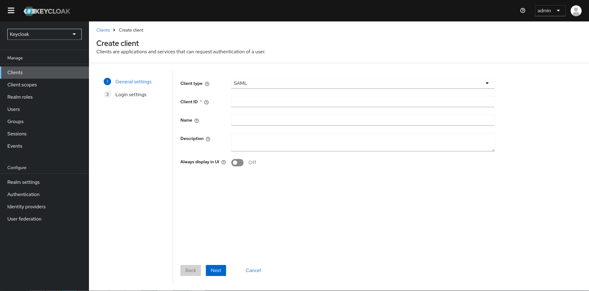
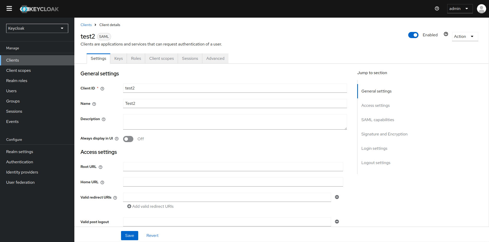

# Clientes SAML

## GEstion de Clientes SAML

[SAML (Security Assertion Markup Language)](https://www.keycloak.org/docs/latest/server_admin/index.html#saml) es un protocolo popular para asegurar aplicaciones, especialmente en entornos empresariales. Fue diseñado para permitir el intercambio seguro de información de autenticación y autorización entre un proveedor de identidad (IdP) y un proveedor de servicios (SP), siendo ampliamente compatible con aplicaciones web tradicionales y de empresa.

## Creación de un cliente SAML

Keycloak es compatible con SAML 2.0 para aplicaciones registradas. Se admiten enlaces POST y Redirect. Puedes elegir requerir la validación de la firma del cliente. También puedes hacer que el servidor firme y/o cifre las respuestas.

1. Haz clic en **Clients** en el menú.

2. Haz clic en **Create client** para ir a la página de Crear cliente.

3. Establece el **Client type** en SAML.

   

4. Introduce el **Client ID**. A menudo, este es un URL y es el valor esperado del emisor en las solicitudes SAML enviadas por la aplicación.

5. Haz clic en **Next** y luego en **Save**. Esta acción crea el cliente y te lleva a la pestaña Configuración.

Las siguientes secciones describen cada configuración en esta pestaña.

### Pestaña Configuración

La pestaña Configuración incluye muchas opciones para configurar este cliente.

### Configuraciones generales

- **Client ID**: La cadena alfanumérica que se usa en las solicitudes OIDC y en la base de datos de Keycloak para identificar al cliente. Este valor debe coincidir con el valor del emisor enviado con AuthNRequests. Keycloak extrae el emisor de la solicitud SAML de Authn y lo compara con un cliente usando este valor.

- **Name**: El nombre del cliente en la pantalla de UI de Keycloak. Para localizar el nombre, configura un valor de cadena de reemplazo. Por ejemplo, un valor de cadena como ${miapp}. Consulta la Guía del desarrollador del servidor para obtener más información.

- **Description**: La descripción del cliente. Esta configuración también se puede localizar.

- **Always Display in Console**: Listar siempre este cliente en la Consola de cuentas, incluso si este usuario no tiene una sesión activa.

### Configuraciones de acceso

- **Root URL**: Cuando Keycloak utiliza un URL relativo configurado, este valor se antepone al URL.

- **Home URL**: Si Keycloak necesita enlazar con un cliente, se usa esta URL.

- **Valid Redirect URIs**: Introduce un patrón de URL y haz clic en el signo + para agregar. Haz clic en el signo - para eliminar. Haz clic en Guardar para guardar estos cambios. Los valores de comodín solo se permiten al final de una URL. Por ejemplo, [http://host.com/*$$](http://host.com/*$$). Este campo se utiliza cuando los puntos finales SAML exactos no están registrados y Keycloak extrae la URL del consumidor de afirmaciones de una solicitud.

- **IDP-Initiated SSO URL name**: Nombre de fragmento de URL para hacer referencia al cliente cuando se desee realizar un SSO iniciado por IDP. Dejar este campo vacío deshabilitará el SSO iniciado por IDP. El URL que se referenciará desde el navegador será: server-root/realms/{realm}/protocol/saml/clients/{client-url-name}

- **IDP Initiated SSO Relay State**: Estado de relay que se desea enviar con la solicitud SAML cuando se desee realizar un SSO iniciado por IDP.

- **Master SAML Processing URL**: Esta URL se utiliza para todas las solicitudes SAML y la respuesta se dirige al SP. Se utiliza como la URL del Servicio de Consumidor de Afirmaciones y la URL del Servicio de Cierre de Sesión Único.

!!! note

    Si las solicitudes de inicio de sesión contienen la URL del Servicio de Consumidor de Afirmaciones, esas solicitudes de inicio de sesión tendrán prioridad. Esta URL debe ser validada por un patrón de URL de redirección válida registrado.

### Capacidades SAML

- **Name ID Format**: El Formato de ID de Nombre para el sujeto. Este formato se utiliza si no se especifica ninguna política de ID de nombre en una solicitud, o si el atributo Forzar Formato de ID de Nombre está activado.

- **Force Name ID Format**: Si una solicitud tiene una política de ID de nombre, ignórala y usa el valor configurado en la consola de administración bajo Formato de ID de Nombre.

- **Force POST Binding**: De forma predeterminada, Keycloak responde utilizando el binding SAML inicial de la solicitud original. Al habilitar Forzar binding POST, Keycloak responde utilizando el binding POST de SAML, incluso si la solicitud original utilizó el binding de redirección.

- **Force artifact binding**: Si está habilitado, los mensajes de respuesta se devuelven al cliente a través del sistema de binding de artefactos SAML.

- **Include AuthnStatement**: Las respuestas de inicio de sesión SAML pueden especificar el método de autenticación utilizado, como la contraseña, así como las marcas de tiempo del inicio de sesión y la expiración de la sesión. Incluir AuthnStatement está habilitado de forma predeterminada, por lo que el elemento AuthnStatement se incluirá en las respuestas de inicio de sesión. Si se establece en OFF, se evita que los clientes determinen la duración máxima de la sesión, lo que puede crear sesiones de cliente que no expiren.

- **Include OneTimeUse Condition**: Si está habilitado, se incluye una Condición de Un Solo Uso en las respuestas de inicio de sesión.

- **Optimize REDIRECT signing key lookup**: Cuando está activado, los mensajes de protocolo SAML incluyen la extensión nativa de Keycloak. Esta extensión contiene una pista con el ID de la clave de firma. El SP utiliza la extensión para la validación de la firma en lugar de intentar validar la firma utilizando claves.

  !!! note

      Esta opción se aplica a los bindings REDIRECT donde la firma se transfiere en los parámetros de consulta y esta información no se encuentra en la información de la firma. Esto es contrario a los mensajes de binding POST donde el ID de la clave siempre se incluye en la firma del documento.
      Esta opción se utiliza cuando el servidor y el adaptador de Keycloak proporcionan el IDP y el SP. Esta opción solo es relevante cuando Documentos firmados está activado.

