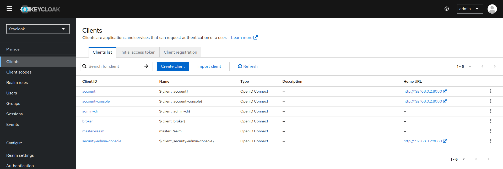
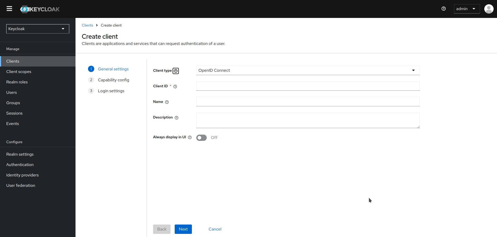

# Gestión de clientes OpenID Connect y SAML

Los clientes son entidades que pueden solicitar la autenticación de un usuario. Existen dos tipos de clientes. El primer tipo es una aplicación que quiere participar en un inicio de sesión único (SSO). Estos clientes solo desean que Keycloak proporcione seguridad para ellos. El otro tipo de cliente es aquel que solicita un token de acceso para invocar otros servicios en nombre del usuario autenticado. Esta sección aborda varios aspectos de la configuración de clientes y las diferentes formas de hacerlo.

## Gestión de clientes OpenID Connect

[OpenID Connect](https://www.keycloak.org/docs/latest/server_admin/index.html#con-oidc_server_administration_guide) es el protocolo recomendado para asegurar aplicaciones. Fue diseñado desde el principio para ser compatible con la web y funciona mejor con aplicaciones HTML5/JavaScript.

## Creación de un cliente OpenID Connect

Para proteger una aplicación que utiliza el protocolo **OpenID Connect**, debes crear un cliente.

    

1. Haz clic en **Clients** en el menú.

2. Haz clic en **Create client**.

    

3. Deja el **Client type** como **OpenID Connect**.

4. Ingresa un **Client ID**.

    !!! tip

        Este ID es una cadena alfanumérica que se utiliza en las solicitudes OIDC y en la base de datos de Keycloak para identificar al cliente.

5. Proporciona un **Nombre** para el cliente.

    !!! tip

        Si planeas localizar este nombre, configura un valor de cadena de reemplazo. Por ejemplo, un valor de cadena como ${myapp}.

6. Haz clic en **Next** en las ventanas siguientes, manteniendo los datos predeterminados, hasta que puedas guardar la información del nuevo cliente.

Esta acción crea el cliente y te lleva a la pestaña Configuración, donde puedes realizar la configuración básica.

### Configuración básica

La pestaña de Configuración incluye muchas opciones para configurar este cliente.
