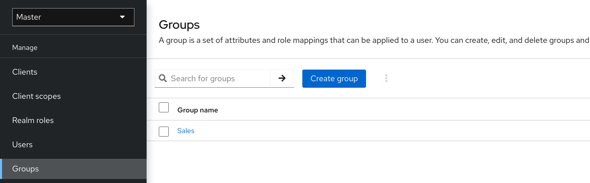
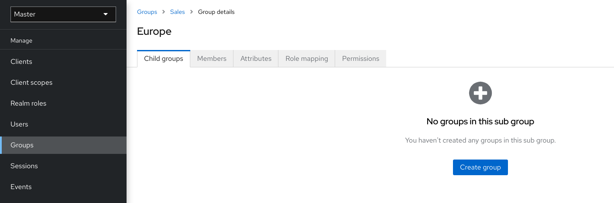
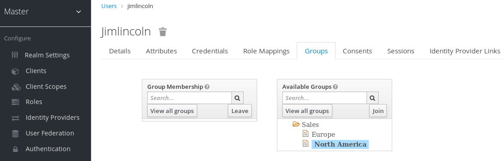
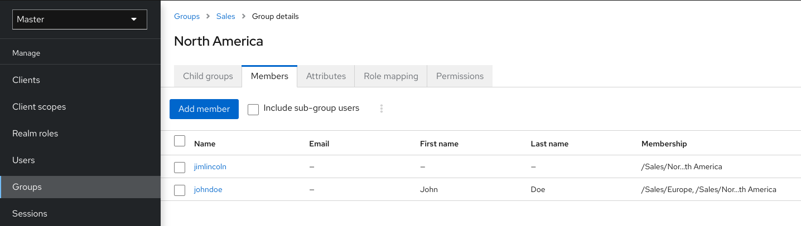
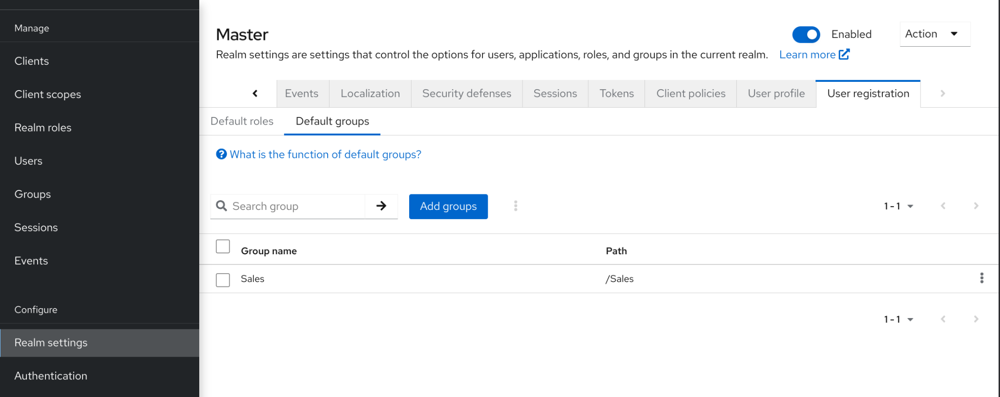

# Grupos

Los grupos en Keycloak gestionan un conjunto común de atributos y asignaciones de roles para cada usuario. Los usuarios pueden ser miembros de cualquier número de grupos y heredan los atributos y asignaciones de roles asignados a cada grupo.

Para gestionar grupos, haz clic en **Groups** en el menú.



Los grupos son jerárquicos. Un grupo puede tener múltiples subgrupos, pero un grupo solo puede tener un padre. Los subgrupos heredan los atributos y asignaciones de roles de su padre. Los usuarios heredan los atributos y asignaciones de roles de su padre también.

Si tienes un grupo padre y un grupo hijo, y un usuario que pertenece solo al grupo hijo, el usuario en el grupo hijo hereda los atributos y asignaciones de roles tanto del grupo padre como del grupo hijo.

La jerarquía de un grupo a veces se representa usando la ruta del grupo. La ruta es la lista completa de nombres que representa la jerarquía de un grupo específico, de arriba hacia abajo y separada por barras inclinadas / (similar a los archivos en un sistema de archivos). Por ejemplo, una ruta puede ser /superior/nivel1/nivel2, lo que significa que superior es un grupo de nivel superior y es padre de nivel1, que a su vez es padre de nivel2. Esta ruta representa de manera inequívoca la jerarquía para el grupo nivel2.

Debido a razones históricas, Keycloak no escapa las barras inclinadas en el nombre del grupo. Por lo tanto, un grupo llamado nivel1/grupo bajo superior usa la ruta /superior/nivel1/grupo, lo que es engañoso. Keycloak puede iniciarse con la opción --spi-group-jpa-escape-slashes-in-group-path=true y entonces las barras inclinadas en el nombre se escapan con el carácter . El carácter de escape marca que la barra inclinada es parte del nombre y no tiene un significado jerárquico. El ejemplo anterior de la ruta sería /superior/nivel1/grupo cuando está escapado.

```bash
bin/kc.[sh|bat] start --spi-group-jpa-escape-slashes-in-group-path=true
```

El siguiente ejemplo incluye un grupo de nivel superior Ventas y un subgrupo hijo, Norteamérica.

1. Haz clic en el grupo.

2. Haz clic en **Create group**.

3. Introduce un nombre para el grupo.

4. Haz clic en Create.

5. Haz clic en el nombre del grupo.

Se muestra la página de gestión del grupo.



Los atributos y asignaciones de roles que definen son heredados por los grupos y usuarios que son miembros del grupo.

Para agregar un usuario a un grupo:

1. Haz clic en **Users** en el menú.

2. Haz clic en el usuario al que deseas realizar una asignación de roles. Si el usuario no aparece, haz clic en **View all users**.

3. Haz clic en **Groups**.



4. Haz clic en **Join Group**.

5. Selecciona un grupo en el diálogo.

6. Selecciona un grupo del árbol **Available Groups**.

7. Haz clic en **Join**.

Para eliminar un grupo de un usuario:

1. Haz clic en **Users** en el menú.

2. Haz clic en el usuario que deseas eliminar del grupo.

3. Haz clic en **Leave** en la fila de la tabla de grupos.

En este ejemplo, el usuario jimlincoln está en el grupo Norteamérica. Puedes ver a jimlincoln bajo la pestaña Miembros del grupo.



## Comparación entre grupos y roles

Los grupos y roles tienen algunas similitudes y diferencias. En Keycloak, los grupos son una colección de usuarios a los que se les aplican roles y atributos. Los roles definen tipos de usuarios y las aplicaciones asignan permisos y control de acceso a los roles.

Los roles compuestos son similares a los grupos ya que brindan la misma funcionalidad. La diferencia entre ellos es conceptual. Los roles compuestos aplican el modelo de permisos a un conjunto de servicios y aplicaciones. Usa roles compuestos para gestionar aplicaciones y servicios.

Los grupos se enfocan en colecciones de usuarios y sus roles en una organización. Usa grupos para gestionar usuarios.

## Uso de grupos predeterminados

Para asignar automáticamente la pertenencia a un grupo a cualquier usuario que sea creado o importado a través de la intermediación de identidad, utiliza grupos predeterminados.

1. Haz clic en **Realm settings** en el menú.

2. Haz clic en la pestaña **User registration**.

3. Haz clic en la pestaña **Default Groups**.




