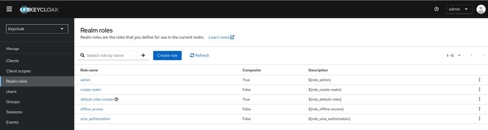
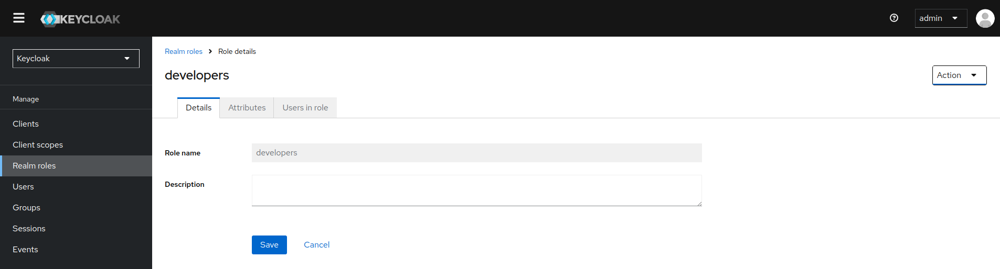
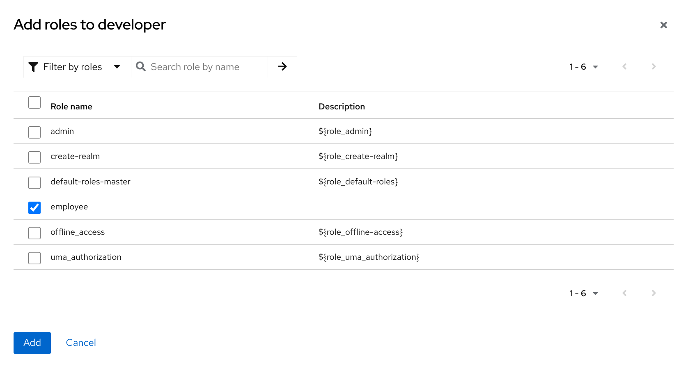
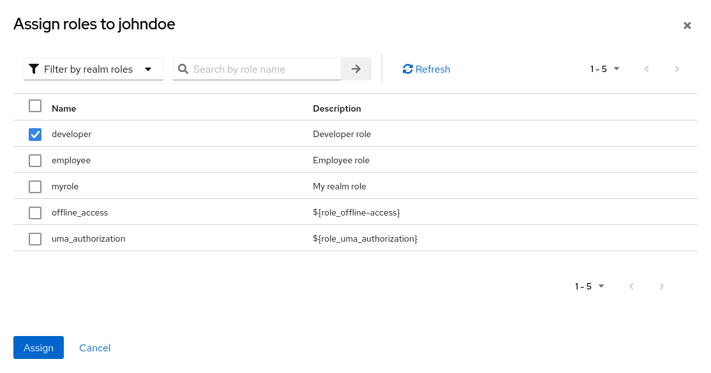
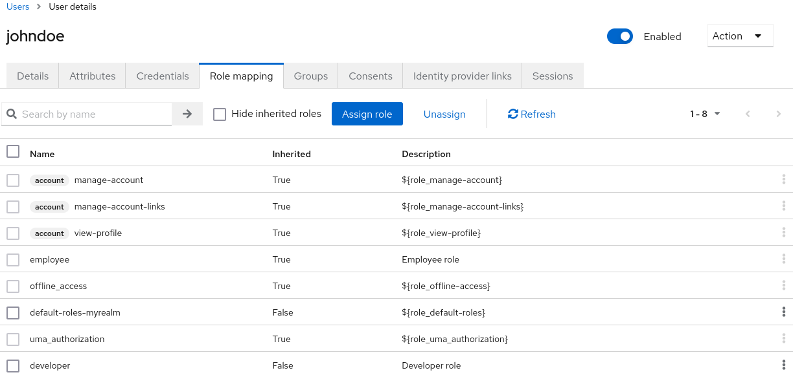
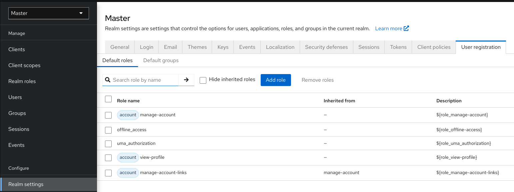
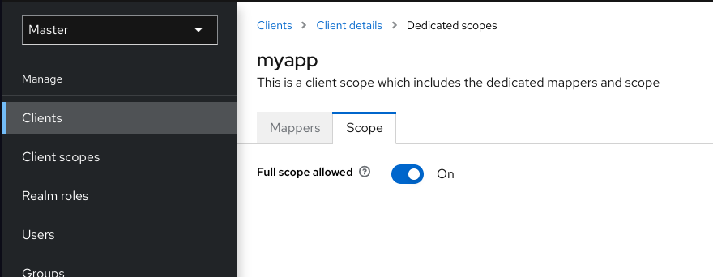
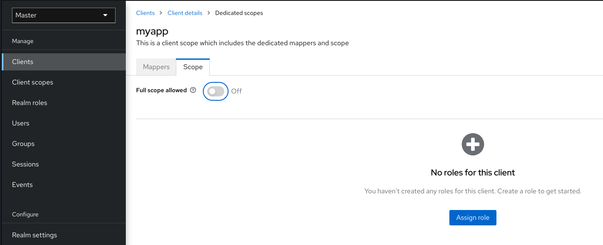

# Roles

## Creación de un rol de ámbito

Los roles a nivel de ámbito son un espacio de nombres para definir tus roles. Para ver la lista de roles, haz clic en Roles de ámbito en el menú.

1. Haz clic en **Create Role**.

2. Introduce un **Role Name**.

3. Introduce una **Description**.

4. Haz clic en **Save**.

El campo de descripción se puede localizar especificando una variable de sustitución con cadenas ${var-name}. El valor localizado se configura en tu tema dentro de los archivos de propiedades de los temas.

## Roles de cliente

Los roles de cliente son espacios de nombres dedicados a los clientes. Cada cliente obtiene su propio espacio de nombres. Los roles de cliente se gestionan en la pestaña Roles de cada cliente. Interactúas con esta IU de la misma manera que con los roles a nivel de ámbito.

## Conversión de un rol a un rol compuesto

Cualquier rol a nivel de ámbito o cliente puede convertirse en un rol compuesto. Un rol compuesto es un rol que tiene uno o más roles adicionales asociados con él. Cuando un rol compuesto se asigna a un usuario, el usuario adquiere los roles asociados con el rol compuesto. Esta herencia es recursiva, por lo que los usuarios también heredan cualquier compuesto de compuestos. Sin embargo, recomendamos que no se abuse de los roles compuestos.

1. Haz clic en **Realm Roles** en el menú.

2. Haz clic en el rol que deseas convertir.

3. En la lista de Acciones, selecciona **Add associated roles**.

La IU de selección de roles se muestra en la página y puedes asociar roles a nivel de ámbito y a nivel de cliente con el rol compuesto que estás creando.

En este ejemplo, el rol a nivel de ámbito empleado está asociado con el rol compuesto desarrollador. Cualquier usuario con el rol desarrollador también hereda el rol empleado.

!!! note

    Al crear tokens y aserciones SAML, cualquier compuesto también tiene sus roles asociados agregados a las reclamaciones y aserciones de la respuesta de autenticación enviada de vuelta al cliente.

## Asignación de asignaciones de roles

Puedes asignar asignaciones de roles a un usuario a través de la pestaña **Role Mappings** para ese usuario.

1. Haz clic en **Users** en el menú.

2. Haz clic en el usuario al que deseas realizar una asignación de roles.

3. Haz clic en la pestaña **Role mappings**.

4. Haz clic en **Assign role**.

5. Selecciona el rol que deseas asignar al usuario en el diálogo.

6. Haz clic en **Assign**.

En el ejemplo anterior, estamos asignando el rol compuesto desarrollador a un usuario. Ese rol fue creado en el tema de Roles Compuestos.

Cuando se asigna el rol desarrollador, el rol empleado asociado con el rol compuesto desarrollador se muestra con Heredado **True**. Los roles heredados son los roles asignados explícitamente a los usuarios y los roles que se heredan de los compuestos.

## Uso de roles predeterminados
Utiliza roles predeterminados para asignar automáticamente asignaciones de roles de usuario cuando se crea o importa un usuario a través de la intermediación de identidad.

1. Haz clic en **Realm settings** en el menú.

2. Haz clic en la pestaña **User registration**.

## Asignaciones de ámbito de roles

Al crear un token de acceso OIDC o una aserción SAML, las asignaciones de roles de usuario se convierten en reclamaciones dentro del token o aserción. Las aplicaciones utilizan estas reclamaciones para tomar decisiones de acceso sobre los recursos controlados por la aplicación. Keycloak firma digitalmente los tokens de acceso y las aplicaciones los reutilizan para invocar servicios REST seguros de forma remota. Sin embargo, estos tokens tienen un riesgo asociado. Un atacante puede obtener estos tokens y utilizar sus permisos para comprometer tus redes. Para evitar esta situación, utiliza Asignaciones de Ámbito de Roles.

Las Asignaciones de Ámbito de Roles limitan los roles declarados dentro de un token de acceso. Cuando un cliente solicita una autenticación de usuario, el token de acceso que recibe contiene solo las asignaciones de roles que se especifican explícitamente para el ámbito del cliente. El resultado es que limitas los permisos de cada token de acceso individual en lugar de otorgar al cliente acceso a todos los permisos de los usuarios.

De manera predeterminada, cada cliente obtiene todas las asignaciones de roles del usuario. Puedes ver las asignaciones de roles para un cliente.

1. Haz clic en **Clients** en el menú.

2. Haz clic en el cliente para ver los detalles.

3. Haz clic en la pestaña **Client scopes**.

4. Haz clic en el enlace en la fila con el alcance dedicado y los asignadores para este cliente.

5. Haz clic en la pestaña **Scope**.

De manera predeterminada, los roles efectivos de los ámbitos son todos los roles declarados en el ámbito. Para cambiar este comportamiento predeterminado, cambia **Full Scope Allowed** a **OFF** y declara los roles específicos que deseas en cada cliente. También puedes usar los alcances de cliente para definir las mismas asignaciones de ámbito de rol para un conjunto de clientes.

