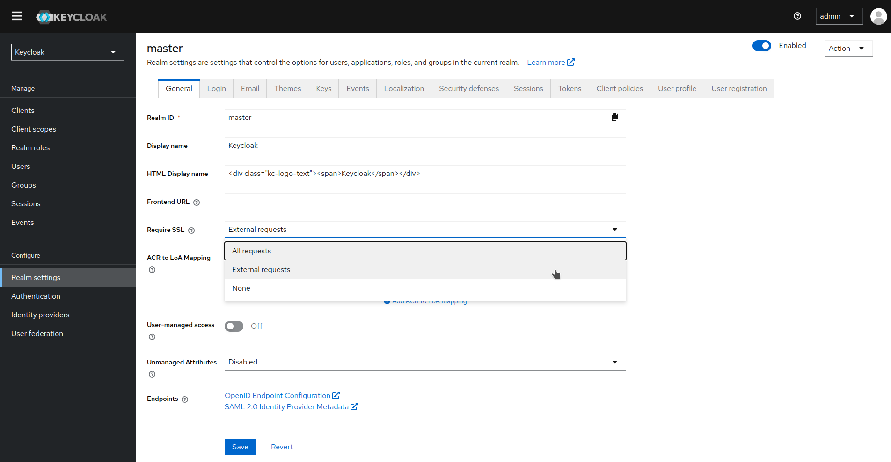
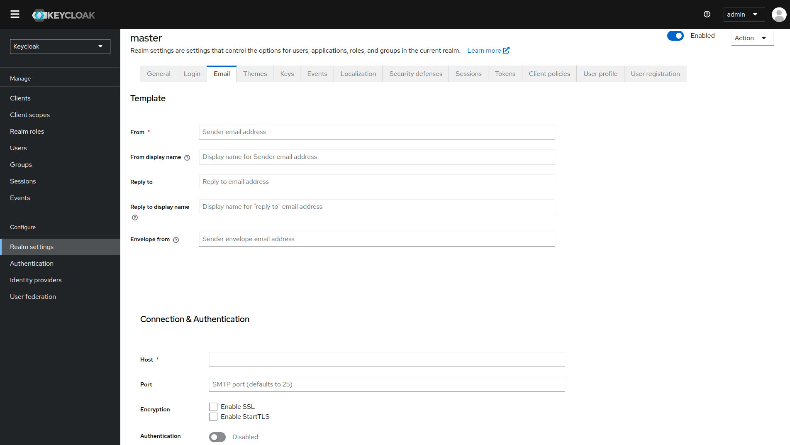
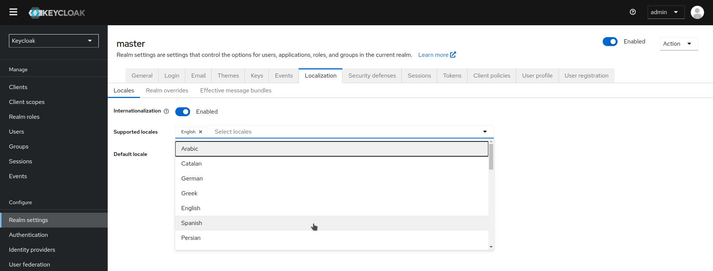

# Configuraciones

## Configuración de SSL para un realm

Cada realm tiene un Modo SSL asociado, que define los requisitos de SSL/HTTPS para interactuar con el realm. Los navegadores y aplicaciones que interactúan con el realm deben cumplir con los requisitos de SSL/HTTPS definidos por el Modo SSL, de lo contrario, no podrán interactuar con el servidor.

1. Haz clic en **Realm settings (Configuración del realm)** en el menú.
2. Haz clic en la pestaña **General**.

    
    
3. Establece **Require SSL (Requerir SSL)** en uno de los siguientes modos SSL:
   - **External requests (Solicitudes externas)**: Los usuarios pueden interactuar con Keycloak sin SSL siempre que se limiten a direcciones IP privadas, como localhost, 127.0.0.1, 10.x.x.x, 192.168.x.x y 172.16.x.x. Si intentas acceder a Keycloak sin SSL desde una dirección IP no privada, recibirás un error.
   - **None (Ninguno)**: Keycloak no requiere SSL. Esta opción se aplica solo en desarrollo cuando estás experimentando y no planeas utilizar esta implementación en producción.
   - **All requests (Todas las solicitudes)**: Keycloak requiere SSL para todas las direcciones IP.
   
## Configuración de correo electrónico para un realm

Keycloak envía correos electrónicos a los usuarios para verificar sus direcciones de correo electrónico, cuando olvidan sus contraseñas o cuando un administrador necesita recibir notificaciones sobre un evento del servidor. Para habilitar que Keycloak envíe correos electrónicos, debes proporcionar a Keycloak la configuración de tu servidor SMTP.

1. Haz clic en **Realm settings (Configuración del realm)** en el menú.

2. Haz clic en la pestaña **Email (Correo electrónico)**.

    
  
3. Rellena los campos y activa los interruptores según sea necesario:

    1. **Template**
      
        - **From**: Indica la dirección utilizada para el campo "De" en el encabezado SMTP de los correos electrónicos enviados.
        - **From display name**: Permite configurar un alias de dirección de correo electrónico amigable (opcional). Si no se establece, se mostrará la dirección de correo electrónico simple en los clientes de correo.
        - **Reply to**: Indica la dirección utilizada para el campo "Responder a" en el encabezado SMTP de los correos enviados (opcional). Si no se establece, se usará la dirección de correo simple "De".
        - **Reply to display name**: Permite configurar un alias de dirección de correo electrónico amigable (opcional). Si no se establece, se mostrará la dirección simple "Responder a".
        - **Envelope from**: Indica la dirección de rebote utilizada para el encabezado Return-Path en los correos enviados (opcional).
        
    2. **Conexión y autenticación**
        
        - **Host**: Indica el nombre del servidor SMTP utilizado para enviar correos electrónicos.
        - **Port**: Indica el puerto del servidor SMTP.
        - **Encryption**: Marca una de estas casillas de verificación para admitir el envío de correos electrónicos para la recuperación de nombres de usuario y contraseñas, especialmente si el servidor SMTP está en una red externa. Es probable que debas cambiar el puerto a 465, el puerto predeterminado para SSL/TLS.
        - **Authentication**: Activa este interruptor si tu servidor SMTP requiere autenticación. Cuando se te solicite, proporciona el nombre de usuario y la contraseña. El valor del campo de contraseña puede referirse a un valor de un almacén externo.
        
## Habilitar internacionalización

Cada pantalla de la interfaz de usuario en Keycloak está internacionalizada. El idioma predeterminado es inglés, pero puedes elegir qué configuraciones regionales deseas soportar y cuál será la configuración regional predeterminada.

1. Haz clic en Realm settings (Configuración del realm) en el menú.

2. Haz clic en la pestaña Localizatión.

3. Habilita la Internationalization.

4. Selecciona los idiomas que soportarás.
    
    
    
La próxima vez que un usuario inicie sesión, podrá elegir un idioma en la página de inicio de sesión para usar en las pantallas de inicio de sesión, la Consola de Cuenta y la Consola de Administración.

   
      
