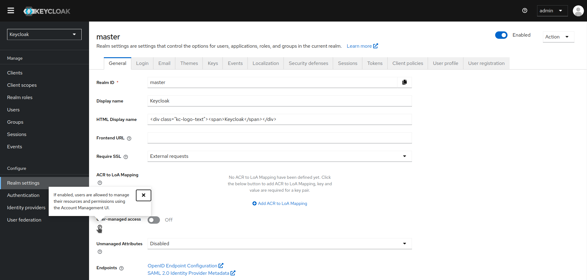
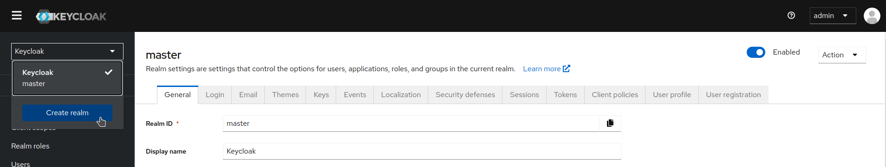
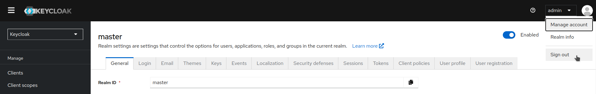
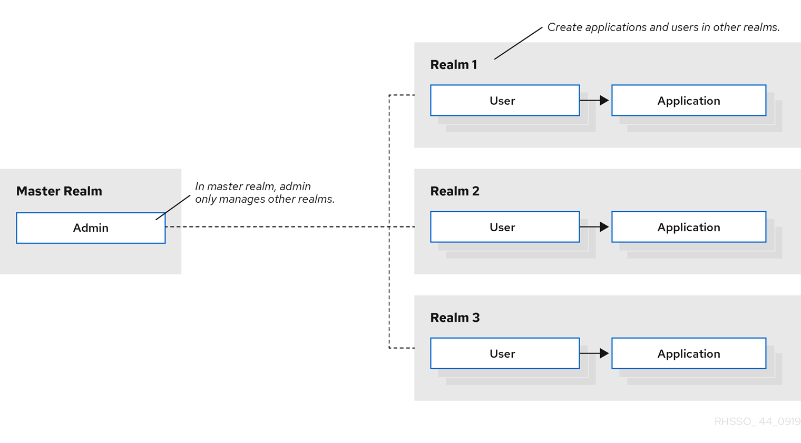
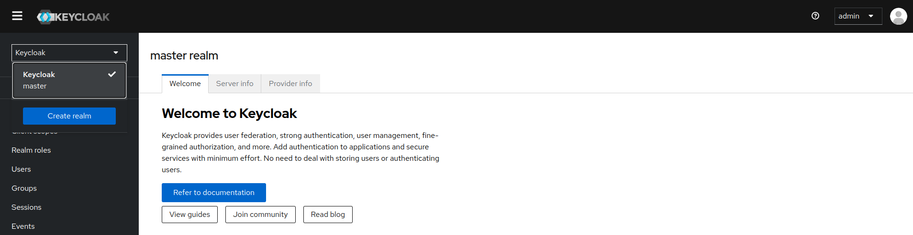
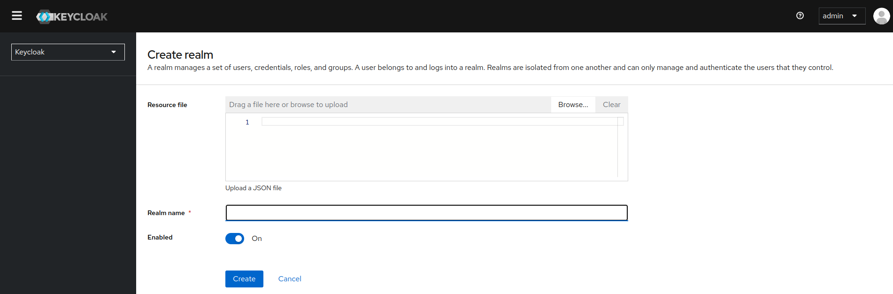

#  Configuración de realms

Teniendo una cuenta con acceso a la Consola de Administración, puedes configurar realms. Un realm es un espacio donde gestionas objetos, incluidos usuarios, aplicaciones, roles y grupos. Un usuario pertenece a un realm e inicia sesión en él. Una implementación de Keycloak puede definir, almacenar y gestionar tantos realms como permita el espacio en la base de datos.

## Uso de la Consola de Administración

1. Ve a la URL de la Consola de Administración. Por ejemplo, para localhost, usa esta URL: [http://localhost:8080/admin/](http://localhost:8080/admin/)

    

2. Ingresa el nombre de usuario y la contraseña con permisos de administración. Esta acción mostrará la Consola de Administración.

    

3. Ten en cuenta los menús y otras opciones que puedes usar:

    - Haz clic en el menú etiquetado como **Master** para elegir un realm que desees gestionar o para crear uno nuevo.

        

    - Haz clic en la lista en la parte superior derecha para ver tu cuenta o cerrar sesión.

        

    - Haz clic en un icono de signo de interrogación (?) para mostrar un texto de ayuda que describe ese campo. La imagen del punto 2 muestra la ayuda en acción.

!!! info

    Los archivos exportados desde la Consola de Administración no son adecuados para copias de seguridad o transferencia de datos entre servidores. Solo las exportaciones en tiempo de arranque son adecuadas para copias de seguridad o transferencia de datos entre servidores.

## El realm master

En la Consola de Administración existen dos tipos de realms:

- **Realm master**: Este realm se creó para ti cuando iniciaste Keycloak por primera vez. Contiene la cuenta de administrador que se creó en el primer inicio de sesión. Usa el realm master sólo para crear y gestionar los realms en tu sistema.
- **Otros realms**: Estos realms son creados por el administrador en el realm master. En estos realms, los administradores gestionan a los usuarios de tu organización y las aplicaciones que necesitan. Las aplicaciones son propiedad de los usuarios.

    

Los realms están aislados entre sí y solo pueden gestionar y autenticar a los usuarios que controlan. Seguir este modelo de seguridad ayuda a prevenir cambios accidentales y sigue la tradición de permitir que las cuentas de usuario accedan sólo a aquellos privilegios y poderes necesarios para la finalización exitosa de su tarea actual.

## Creación de un realm

Creas un Realm para proporcionar un espacio de gestión donde puedas crear usuarios y darles permisos para usar aplicaciones. En el primer inicio de sesión, normalmente estás en el realm master, el realm de nivel superior desde el cual creas otros realms.

Al decidir qué realms necesitas, considera el tipo de aislamiento que deseas tener para tus usuarios y aplicaciones. Por ejemplo, podrías crear un realm para los empleados de tu empresa y un realm separado para tus clientes. Tus empleados iniciarían sesión en el realm de empleados y solo podrían visitar aplicaciones internas de la empresa. Los clientes iniciarían sesión en el realm de clientes y solo podrían interactuar con aplicaciones orientadas al cliente.

1. Haz clic en Keycloak junto al realm master, luego haz clic en Crear Realm.

    

2. Ingresa un nombre para el realm.
3. Haz clic en Crear.

    

El realm actual ahora se ha establecido en el realm que acabas de crear. Puedes cambiar entre realms haciendo clic en el nombre del realm en el menú.
