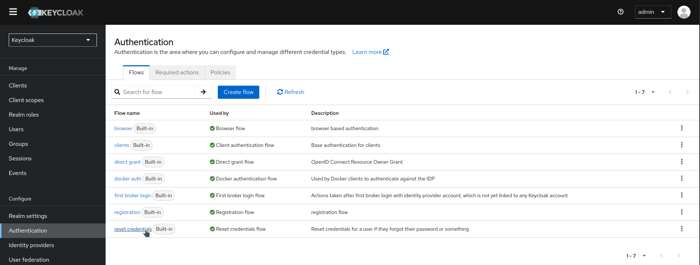
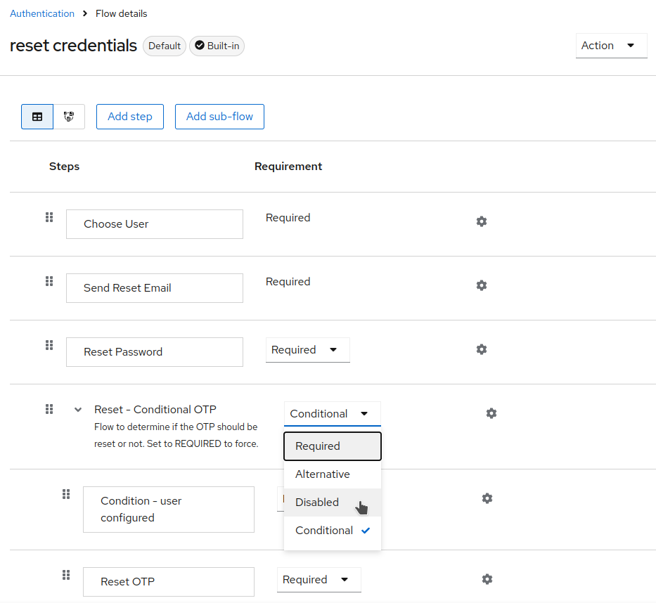
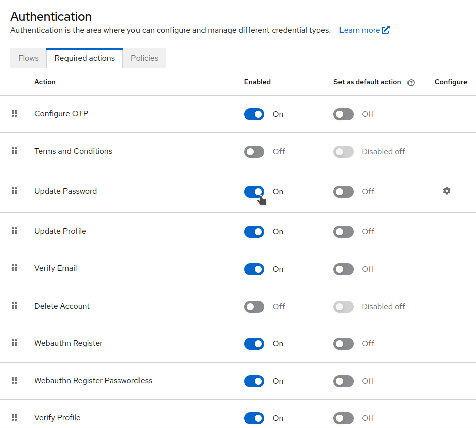
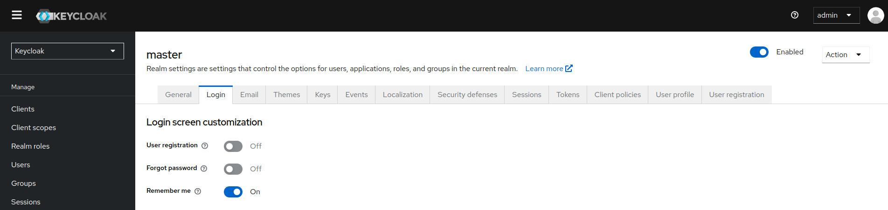
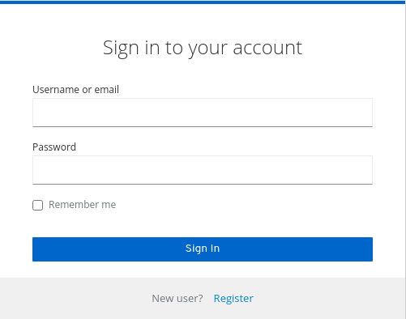

# Control de las opciones de inicio de sesión

Keycloak incluye varias funciones integradas en la página de inicio de sesión.

## Habilitar "Olvidé mi contraseña"

Si habilitas la opción "Olvidé mi contraseña", los usuarios pueden restablecer sus credenciales de inicio de sesión si olvidan sus contraseñas o pierden su generador de OTP.

1. Haz clic en **Realm settings (Configuración del realm)**  en el menú.

2. Haz clic en la pestaña **Login**.

    

3. Activa la opción **Forgot password**.
   Un enlace ¿Olvidaste tu contraseña? se mostrará en tus páginas de inicio de sesión.

    
    
4. Especifica **Host** y **From** en la pestaña **Email** para que Keycloak pueda enviar el correo electrónico de restablecimiento.

5. Haz clic en este enlace para llevar a los usuarios a una página donde pueden ingresar su nombre de usuario o dirección de correo electrónico y recibir un correo electrónico con un enlace para restablecer sus credenciales.

    
    
El texto enviado en el correo electrónico es configurable. 

Cuando los usuarios hagan clic en el enlace del correo electrónico, Keycloak les pedirá que actualicen su contraseña y, si han configurado un generador de OTP, Keycloak les pedirá que reconfiguren el generador de OTP. Dependiendo de los requisitos de seguridad de tu organización, es posible que no desees que los usuarios restablezcan su generador de OTP por correo electrónico.

Para cambiar este comportamiento, sigue estos pasos:

1. Haz clic en **Authentication** en el menú.

2. Haz clic en la pestaña **Flows**.

3. Selecciona el flujo **Reset Credentials**.

    

4. Si no deseas restablecer el OTP, establece el requisito del sub-flujo **Reset - Conditional OTP** en **Disabled**.

    

5. Haz clic en **Authentication** en el menú.

6. Haz clic en la pestaña **Required actions**.

7. Asegúrate de que **Update Password** esté habilitado.

    

## Habilitar "Recordarme"

Si un usuario que ha iniciado sesión cierra su navegador, su sesión se destruye, y debe volver a iniciar sesión. Puedes configurar Keycloak para mantener la sesión de inicio de sesión abierta si el usuario hace clic en la casilla Recordarme al iniciar sesión. Esta acción convierte la cookie de inicio de sesión de una cookie de sesión a una cookie persistente.

1. Haz clic en **Realm settings (Configuración del realm)**  en el menú.

2. Haz clic en la pestaña **Login**.

3. Activa la opción **Remember Me**.

    

4. Cuando guardes esta configuración, una casilla de verificación **Remember me** se mostrará en la página de inicio de sesión del realm.

    

Para ver más información sobre la configuración de realms, consulta la [documentación oficial](https://www.keycloak.org/docs/latest/server_admin/index.html#configuring-realms)
